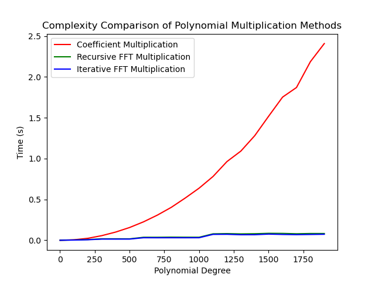
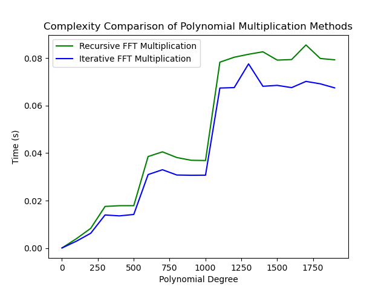

# Polynomials and FFT

Implementation of algorithms described in the "Polynomials and the FFT" chapter of "Introduction to Algorithms" by
Thomas H. Cormen, Charles E. Leiserson, Ronald L. Rivest, and Clifford Stein.

## Structure
- **baseline.py**: baseline polynomial operations
- **fft.py**: faster polynomial multiplication using FFT
- **test**: unit tests
- **mul_complexity.py**: complexity curve plotting script

## Performance

    
    

